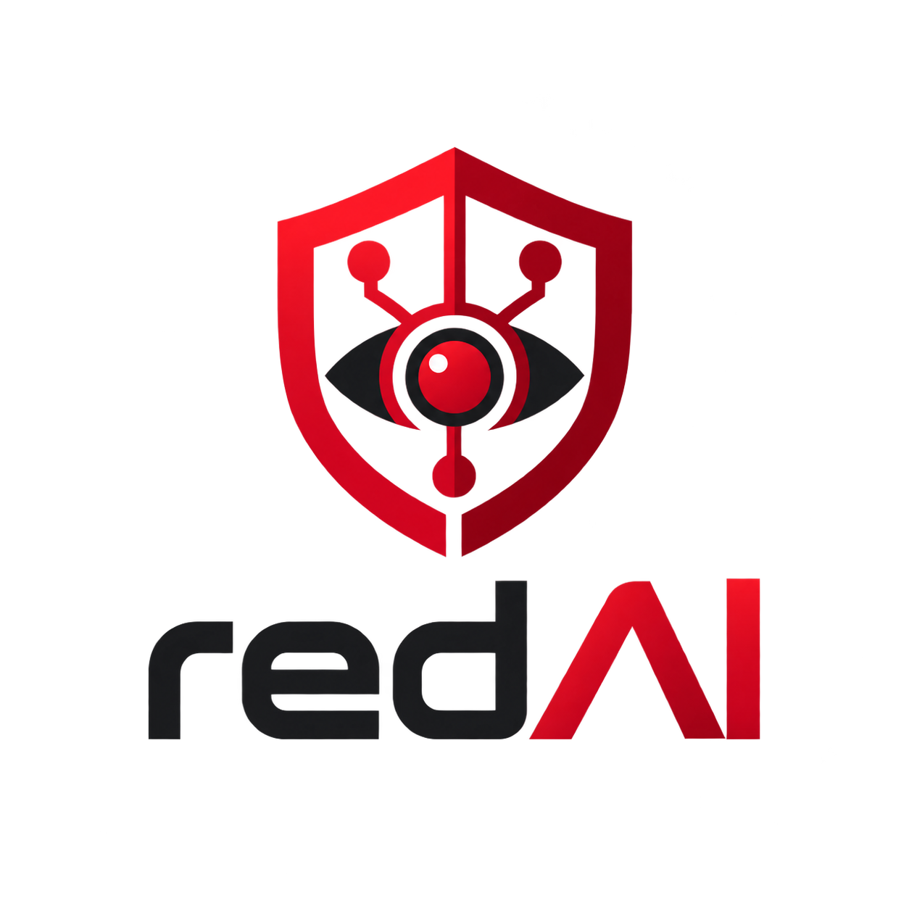

<p align="center"></p>

# redAI Personal v1

Self-hosted, single-owner security-testing workbench with a **Project → Chat →
Agent** experience. This repository is being implemented from the specification
package in [`specs/`](specs/) and [`docs/`](docs/).

> **Scope & safety.** redAI runs tool execution only inside authorized scope.
> Network is **offline by default**; a Project scope (with DNS proof) must be
> granted before any target traffic. Third-party infrastructure is never tested
> without explicit authorization. See [`docs/10-authorization-scope.md`](docs/10-authorization-scope.md)
> and [`docs/16-threat-model.md`](docs/16-threat-model.md).

## Status

Implementation is milestone-driven (M0–M7, tasks T00–T36). Live progress is in
[`implementation/STATUS.md`](implementation/STATUS.md). **M0 (foundation)** is in
progress.

## Architecture (locked)

Next.js web · Fastify API · TypeScript runtime · Go worker (Linux) · PostgreSQL ·
local ObjectStore · SSE for UI realtime. Rationale and boundaries:
[`docs/04-architecture-repository.md`](docs/04-architecture-repository.md).

## Layout

```
apps/{web,api,runtime}   TypeScript processes
packages/*               domain, contracts, application, policy, db, llm, storage, observability, ui
worker/                  Go worker daemon (cmd + internal/*)
contracts/               canonical JSON Schema + OpenAPI (single edited source)
db/                      reference DDL (T02 turns this into versioned migrations)
docs/  adr/  implementation/   design, decisions, backlog & status
ops/  tools/  tests/      operations, toolbox, test suites
specs/                   frozen input spec package (provenance; not edited)
```

## Prerequisites

Pinned in [`docs/dependency-baseline.md`](docs/dependency-baseline.md):
Node **22.x**, pnpm **10.x** (via Corepack), Go **1.24.x**, PostgreSQL **16+**.

```bash
corepack enable
pnpm install
```

## Develop (no model key required)

You can build, test, and run the platform skeleton without any model provider
credential — the health surface simply reports `unconfigured` until components
are set up.

```bash
pnpm run env:check     # verify the pinned toolchain
pnpm run check         # env + typecheck + lint + format + test + build + Go checks
```

Individual commands:

| Command | What it does |
|---|---|
| `pnpm run typecheck` | `tsc -b` across the workspace |
| `pnpm run test` | Vitest unit + import-boundary tests |
| `pnpm run build` | Build all TS packages |
| `pnpm run lint` / `pnpm run format` | ESLint / Prettier check |
| `pnpm run go:check` | `go vet && go build && go test` in `worker/` |

Run the API health server locally:

```bash
pnpm --filter @redai/api run dev
curl -s localhost:8787/api/health/live      # {"status":"live"}
curl -s localhost:8787/api/health/ready      # 503 unconfigured until DATABASE_URL + OBJECT_STORE_ROOT are set
```

## Contributing to the build

The multi-agent build process, wave schedule, and file-ownership rules are in
[`docs/agent-execution-plan.md`](docs/agent-execution-plan.md). Coordinator books:
[`implementation/ASSIGNMENTS.md`](implementation/ASSIGNMENTS.md),
[`implementation/HANDOFF.md`](implementation/HANDOFF.md),
[`docs/implementation-decisions.md`](docs/implementation-decisions.md).

## License

See [`LICENSE`](LICENSE). redAI contains no HackerAI source, logo, or prompts;
the reference is cited by commit in [`docs/19-research-sources.md`](docs/19-research-sources.md).
